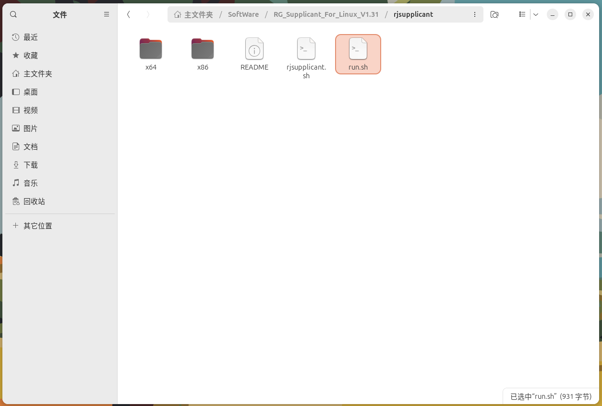
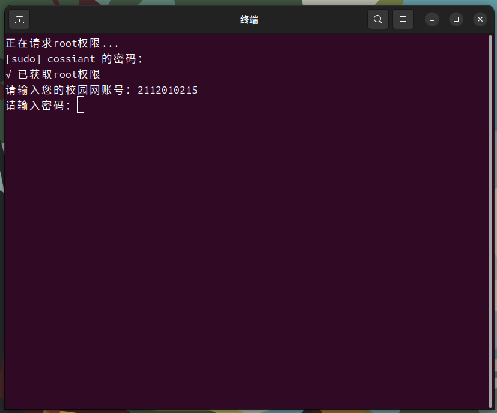

# 哈尔滨理工大学校园网认证linux版使用指南

该脚本用于自动化校园网登录认证流程，支持后台静默运行。

## 使用阶段说明

### 阶段1 - 未认证状态

- **现象**：浏览器访问任意网页时被重定向至校园网认证页面
- **此时需要**：通过本工具完成认证


### 阶段2 - 部署认证工具

```
# 下载并解压
unzip RG_Supplicant_HRBUST_linux.zip

# 赋予执行权限
chmod +x run.sh rjsupplicant.sh

# 运行认证程序
./run.sh
```



### 阶段3 - 身份认证

```
BASH# 将提示以下交互流程
请输入您的校园网账号：<您的学号>
请输入密码：<您的密码>
请再次输入密码：<确认密码>

# 验证成功后将看到：
✔ 已启动校园网认证（后台运行）
```



### 阶段4 - 后台运行

- 认证凭据已加密存储于系统密钥环
- 进程自动进入后台守护模式
- 断线后自动重连（需网络环境恢复）


## 功能特性

- 架构自动检测（x86/x64）
- 密码输入隐藏及验证
- 后台守护进程管理
- 系统日志集成（journalctl）

## 管理命令

```
BASH# 查看运行状态
journalctl -u rjsupplicant

# 停止认证服务
sudo pkill rjsupplicant

# 重新认证
重新运行 ./run.sh
```

## 安全说明

⚠️ **重要**

1. 密码仅存储于内存，退出后自动清除
2. 建议在私人设备使用
3. 定期更新密码请重新运行脚本

## 兼容性

✅ 测试通过：

- Ubuntu 24.04+
- ~~CentOS 7+~~(将会进行测试)
- ~~Debian 10+~~(将会进行测试)

## 问题反馈

如遇认证失败，请提供：

1. 操作系统版本
2. 网络环境（有线/无线）
3. `journalctl -u rjsupplicant` 日志片段或 `nohup.out`日志文件